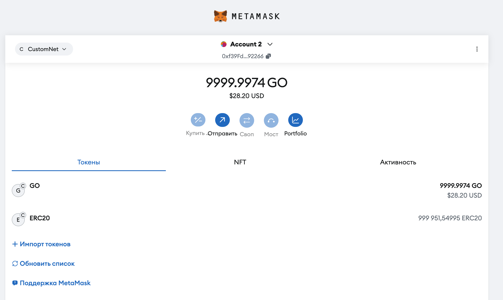

# WEB3

### Лукьянчук Богдан Сергеевич, БПИ213
## Структура проекта

Проект состоит из следующих папок:

- **contracts**: содержит реализации смарт-контрактов с учетом требований задания. Все контракты содержат комментарии в формате [NatSpec](https://docs.soliditylang.org/en/latest/natspec-format.html).

- **test**: в данной папке находятся тесты для основных функций смарт-контрактов:
  - `buyTokens`
  - `transfer`
  - `transferFrom`
  
  Тесты проверяют корректность работы этих функций и их взаимодействие с контрактами.

- **deploy_scripts**: содержит скрипты для деплоя смарт-контрактов в локальной блокчейн-сети. Скрипты автоматически разворачивают контракты на локальной ноде и могут быть использованы для развертывания в других сетях.

- **scripts**: включает скрипты для взаимодействия с уже развернутыми смарт-контрактами. 

## Примеры работы

1. **Развертывание смарт-контрактов**  
   С помощью скриптов из папки `deploy_scripts` можно развернуть смарт-контракты на локальной ноде. Ниже представлено изображение процесса деплоя контрактов:
   
   

2. **Взаимодействие с контрактом ERC20**  
   После развертывания контрактов, с помощью скрипта `ERC20usage` можно взаимодействовать с контрактом ERC20. Пример взаимодействия представлен на изображении ниже, где происходит передача токенов между пользователями:

   

3. **Отображение токенов в кошельках**  
   После успешного выполнения операций с контрактом, можно проверить состояние токенов в кошельках участников:
   - Кошелек владельца токенов:
     
     
   - Кошелек другого пользователя (адреса `addr1`):

     

4. **Чтение состояния хранилища смарт-контракта**  
   В проекте также реализован скрипт, который вычисляет слот, где хранится баланс. Пример вывода скрипта:

   
   
## Теоретические вопросы

1. Функция **approve** служит для подтверждения владельцем управления своими токенами другим адресом и реализована по-разному в зависимости от различных стандартов. В стандарте **ERC20** функция служит для разрешения другому адресу на снятие определённого количества токенов. В **ERC721** она устанавливает разрешение для другого адреса на передачу определённого NFT.

2. Основная разница между **ERC721** и **ERC1155** заключается в том, что стандарт **ERC721** поддерживает использование невзаимозаменяемых (уникальных) токенов (NFT), а **ERC1155** совмещает логику работы как с взаимозаменяемыми, так и с невзаимозаменяемыми токенами.

3. **SBT-токен** — уникальный токен идентификации, который отражает характеристики, функции и достижения человека или организации. Такие токены передать невозможно.

4. Для создания собственных **SBT-токенов** можно реализовать смарт-контракт на основе стандарта **ERC721** и отключить возможность передачи токенов между пользователями, а также настроить возможность создания собственных токенов пользователями.
